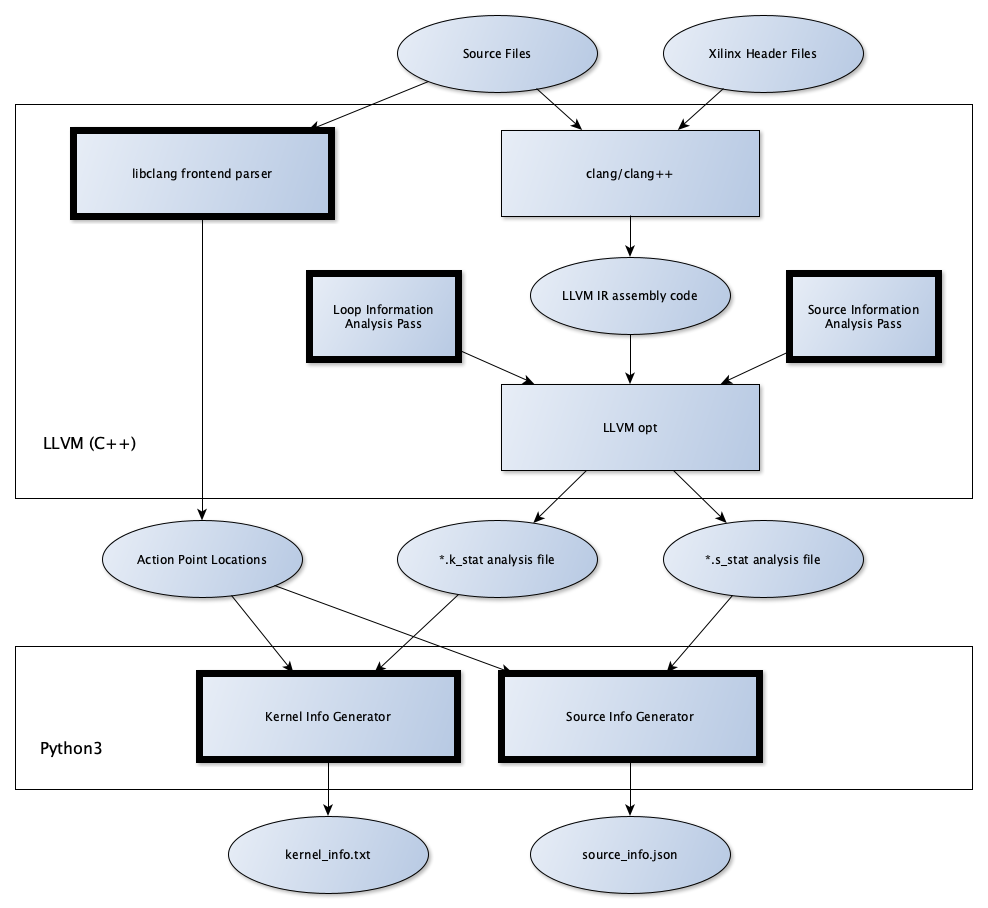

# Parser Architecture

## Block Diagram

## Component List
1. Libclang frontend analyzer
1. Python workflow managers
1. Autogenerated C++ file
1. LLVM opt passes
1. Makefiles
---
## Brief Description

### Libclang Frontend analyzer
Identifies Array Declarations, Loops and their locations

### Python workflow managers
Our Python code works as a glue between all other components, launching subprocesses and processing their output into the desired file formats.

### Autogenerated C++ file
Calculates array bounds and dimensions. **Note: functionality might be moved to LLVM later on.**

### LLVM opt passes
Passes that run on specific regions and extract relevant information from LLVM IR code. At the current stage they are used for two purposes. Extracting loop information (nesting level, tripcount, innermost/outermost status, subloops) and calculating the number and type of instructions that will be executed by every loop.

### Makefiles
Makefiles generate the intermediate (language and target independent) LLVM IR code and run the opt passes. They also compile the autogenerated C++ file.

---
## Static Analysis with LLVM + clang + opt

### Step 1: Generate LLVM IR
Compile code to LLVM IR code: Generate an **architecture independent** represantation for the code. Easy by using **clang/clang++**. At the moment there is support for C/C++.

**TODO:** Add support for OpenCL

### Step 2: Run custom opt passes on LLVM IR code
LLVM *Loop Passes* iterate over loops and extract the relevant information. These are run **after** some passes that perform constant evaluation and propagation (as well as function inlining for source info generation) in order to extract the maximum amount of information available at compile time.

---
**UNDER EVALUATION**

### Step 3: Extract loop parallelization information with LLVM/Polly

Polly is a tool based on the LLVM Infrastructure that runs on LLVM IR code. Polly utilizes a polyhedral representation in order to optimize code. For our uses, polly might be able provide a solid mathematical proof for loops that carry no dependencies and thus can be parallelized.

---

## Ideal Parser-Analyzer Architecture

- **Frontend**: libclang to identify analysis locations

- **Backend**: LLVM + opt to analyze the locations targeted by libclang

